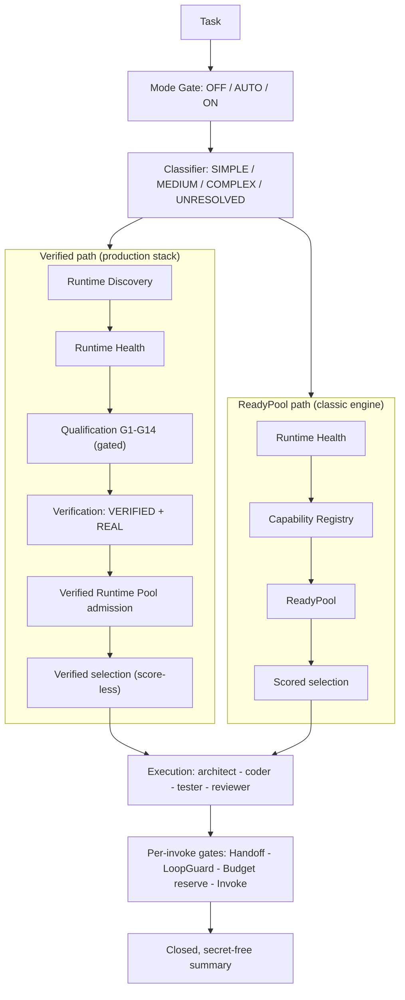

# dual-agent

[](https://github.com/Tsubasa-Kaede/runtime-neutral-agent-engineering/actions/workflows/ci.yml)
[](https://pypi.org/project/dual-agent-development/)
[](https://pypi.org/project/dual-agent-development/)
[](https://github.com/Tsubasa-Kaede/runtime-neutral-agent-engineering/actions/workflows/ci.yml)
[](LICENSE)

> **Discover capabilities. Verify execution. Control collaboration.**
> A verified orchestration layer over coding-agent CLIs — your agents work with receipts.

**简体中文 → [README.zh-CN.md](README.zh-CN.md)**

`dual-agent` is an engineering layer between your application and the coding-agent
CLIs it drives (Claude Code, Codex CLI, Gemini CLI, …). It discovers what is
installed, verifies what each runtime can actually prove, admits it to a
verified pool, and orchestrates architect → coder → tester → reviewer work
under explicit budgets and loop protection — with provenance on every result.

**Agent runtime ≠ agent orchestration.** Runtimes execute; this project engineers
the layer above them. It is not a chatbot, a model provider, a single-runtime
wrapper, or a distributed agent network. No network transport, no credentials
touched, zero runtime dependencies (pure standard library).

> Name map: GitHub repository `runtime-neutral-agent-engineering` · PyPI
> distribution `dual-agent-development` · import `dual_agent` · console
> script `dual-agent`. One product, one version truth (`dual_agent.__version__`).

## Try it in 30 seconds — offline, zero credentials

No runtime, no login, no API key, no network. A fresh clone is enough:

```bash
git clone https://github.com/Tsubasa-Kaede/runtime-neutral-agent-engineering.git
cd runtime-neutral-agent-engineering
python examples/offline_mock_run.py
```

Expected output — one closed, secret-free JSON summary:

```json
{"path": "FOUR_STAGE", "status": "SUCCESS", "stages": ["architect", "coder", "tester", "reviewer"], ...}
```

This runs the real production facade end to end with mock adapters — the same
engine, honestly labeled `OFFLINE`. Terminal demo GIF (render once with
[`vhs assets/demo.tape`](assets/demo.tape)):

<!-- [](assets/demo.tape) -->

## Install

Python >= 3.10, zero runtime dependencies, no clone needed:

```bash
pip install dual-agent-development
dual-agent --version

# or run without installing (uv):
uvx --from dual-agent-development dual-agent --version
```

Other ways in: editable install (`pip install -e .` from a checkout) or the
one-command bootstrap (`python scripts/bootstrap.py` — installs this project
only, never touches runtimes, secrets, or system config). Examples like the
offline demo ship with the repository, not the wheel.

## What it does

- **Runtime Discovery** — is a runtime present at all?
- **Runtime Validation** — gated qualification runs (G1–G14) producing real evidence
- **Capability-based Selection** — selection by proven capability, never by name
- **Agent Orchestration** — architect → coder → tester → reviewer stage chains
- **Structured Collaboration** — validated packets over an append-only ledger
- **Budget Control** — invocation slots reserved before every call
- **LoopGuard** — duplicate / repeated-failure / cycle protection before spend
- **Provenance** — every validation result carries `OFFLINE` or `REAL` evidence
- **Security Boundary** — no-secrets contract, content scanning, protected paths

## Three ways to use it

**1. Cross-runtime second opinion.** You live in Claude Code but want Codex CLI
or Gemini CLI on the same task. Adapters normalize every runtime to one
contract, so the four-stage pipeline runs over whatever you qualified — your
orchestration code never names a vendor.

**2. Agent work with receipts.** You need to know the work was bounded and
verified, not just told it succeeded. Every invocation is budgeted before it
happens, LoopGuard rejects duplicates and cycles before any spend, the ledger
is append-only, and every result carries provenance — `REAL` only with
real-call evidence, `OFFLINE` honestly labeled otherwise. No silent fallbacks,
no fabricated success words.

**3. Vendor-neutral agent tooling.** You are building a tool and refuse to
couple it to one runtime. Implement the six-method `ExternalAgentAdapter`
contract and your runtime plugs into discovery, qualification, and
orchestration without touching the engine.

## Two commands, strictly separated

```bash
dual-agent qualify                                        # the ONLY command that qualifies
dual-agent run "Add a slug helper and its test"           # reads persisted evidence
dual-agent run --observe "Add a slug helper and its test" # + execution events on stderr
```

- `qualify` runs the gated G1–G14 qualification over discovered runtimes and
  persists `VERIFIED` + `REAL` evidence under `~/.dual-agent/qualification/`.
  Real model calls require `RUN_REAL_PROVIDER_TESTS=1`; Offline results are
  reported honestly and never persisted — Offline validation is not REAL
  validation. Per-call progress streams to stderr; each call defaults to a
  300-second bound (`--timeout-seconds`).
- `run` only reads persisted evidence. With no evidence it exits `2` with a
  machine-readable reason (`NO_EVIDENCE_NO_QUALIFIER`) — it never
  auto-qualifies and never falls back.

Modes (`--mode`): `OFF` returns the delegated empty result — never silently
runs; `AUTO` (default) classifies the task and routes SIMPLE/MEDIUM to the
single-agent path, COMPLEX to the dual-agent path; `ON` forces the dual-agent
path. Embedding applications can inject a pre-configured facade directly
(`cli.main._facade = my_facade`).

**Multi-Agent Collaboration Cockpit (V3.2)** — `dual-agent cockpit TASK --step
ROLE=RUNTIME_ID [--step ...]` composes a fixed sequential multi-agent run;
every referenced runtime must hold persisted `VERIFIED` qualification
evidence. Exit contract: `0` COMPLETED / `2` FAILED or user error / `3`
ABORTED / `4` PARKED; exactly one machine JSON line on stdout, human
diagnostics on stderr.

## Why not CrewAI / AutoGen / LangGraph?

They are strong tools for building LLM-chaining applications. This project
solves a different problem — engineering discipline over **coding-agent CLIs**
that already exist on your machine:

| | Typical orchestration frameworks | dual-agent |
|---|---|---|
| What is orchestrated | LLM API calls you wire up yourself | external coding-agent CLIs, via adapters |
| Runtime coupling | often one provider or SDK | runtime-neutral: nothing names a vendor |
| Admission | configure and go | gated G1–G14 qualification, `VERIFIED` + `REAL` evidence only |
| Result claims | framework-reported | provenance on every envelope; `REAL` refused without real-call evidence |
| Failure behavior | fallbacks and retries are common features | no fallback, no silent success — closed failure vocabulary |
| Dependencies | heavy SDK stacks | pure standard library, zero runtime dependencies |
| Transport | often cloud/network | local process boundary only; no network transport |

Use them together if you like: this layer does not replace your app framework —
it sits between your application and the agent CLIs.

## How it works



Load-bearing invariant: the verified path never silently borrows the ReadyPool.
An empty verified selection normalizes to `NO_CAPABLE_AGENT` instead of
consulting the ready-pool registry. The five distinctions the engine never
blurs: Discovery ≠ Health, Health ≠ Qualification, Qualification ≠
Verification, Verification ≠ Admission, READY ≠ VERIFIED.

Task lifecycle: one `ProductionFacade` owns exactly one task; budget, guard,
and ledger are per-task. SINGLE path: at most 1 real invocation; four-stage
path: at most 4 (each role exactly once). Failures are structured and
terminal — `*_INVOKE_FAILED`, `*_PACKET_INVALID`, `MISSING_HANDOFF`,
`BUDGET_EXHAUSTED`, `LOOP_GUARD_REJECTED`, `NO_CAPABLE_AGENT`,
`NO_VERIFICATION_CAPABILITY`. Honest retries require a new `task_id`.

Deeper architecture: [docs/architecture/](docs/architecture/overview.md)
(overview, collaboration, execution, ready-vs-verified, runtime lifecycle).

## Agent runtime support

Support is reported at exactly two levels — **REAL VERIFIED** (gated
qualification produced evidence and pool admission) and **adapter
implemented** (offline-tested, not yet REAL-verified in this repository).
Treat adapter-implemented runtimes as unverified until you run
`dual-agent qualify` in your own environment.

| Agent Runtime | Adapter | Offline Tests | REAL Verification |
|---|---|---|---|
| Claude Code CLI | `claude_code_adapter.py` | ✅ | ✅ REAL VERIFIED — full chain + REAL dual-agent collaboration (v2.1.227) |
| Codex CLI | `codex_adapter.py` | ✅ | ✅ REAL VERIFIED — audited multi-runtime four-stage E2E (2026-09) |
| Pi | `pi_adapter.py` | ✅ | ✅ REAL VERIFIED — audited multi-runtime four-stage E2E (2026-09) |
| Gemini CLI | `gemini_adapter.py` | ✅ | ❌ Not performed — gated REAL assets ship in the suite |
| Qwen Code | `qwen_adapter.py` | ✅ | ❌ Not performed |
| OpenCode | `opencode_adapter.py` | ✅ | ❌ Not performed |
| Cline | `cline_adapter.py` | ✅ | ❌ Not performed |
| tiny-agents (Hugging Face) | `tiny_agents_adapter.py` | ✅ | ❌ Not performed |

Prerequisites are runtime-level, never this package's: the CLI is on PATH and
logged in through its own flow (tiny-agents needs `TINY_AGENTS_AGENT_PATH` +
`TINY_AGENTS_COMMAND`). The engine never installs, logs in to, or configures a
runtime, and never reads credentials.

**Help REAL-verify the remaining adapters** — it is the highest-value
contribution right now: install the CLI, run `dual-agent qualify` with
`RUN_REAL_PROVIDER_TESTS=1`, and report your evidence. See
[CONTRIBUTING.md](CONTRIBUTING.md#real-verify-an-adapter-community-program).

## Remote collaboration across a process boundary

Declare an agent (identity + role + runtime binding), compose a remote
session with one call, and exchange verified task packets with an agent
running in its own process on your machine — under the same packet contract
as the local pipeline. The boundary carries packets only — never
conversations, never credentials — and a `DELIVERED` receipt never claims
execution.

```bash
python examples/remote_offline_demo.py   # offline, scripted adapter
python examples/remote_real_claude.py    # with Claude Code CLI installed + logged in
```

Full flow, agent addressing (`agent:{agent-id}:{role}`), and the common
failures table: [docs/architecture/collaboration.md](docs/architecture/collaboration.md).

## Extending: add a runtime

Implement the six-method `ExternalAgentAdapter` protocol — three core
invocation methods (`discover`, `invoke`, `cancel`) plus three health methods
(`check_authentication`, `check_provider_model`, `minimal_health_check`).
Adapters own all runtime specifics (executable resolution, auth state,
subprocess environment whitelist); the orchestrator only sees the protocol,
so adding a runtime never means modifying the orchestrator. Full contract:
[dual-agent-development/references/adapter-contract.md](dual-agent-development/references/adapter-contract.md);
hand probe: `adapter_probe.py`. A step-by-step guide is in
[CONTRIBUTING.md](CONTRIBUTING.md#add-a-new-runtime-adapter).

## Security

- **No-secrets contract**: raw output, secrets, and model reasoning never
  enter packets, the ledger, traces, or results; `content_safety` is the
  single scan authority.
- **Protected paths**: REAL validation snapshots caller-declared credential
  files; any change during the run fails gate G13.
- **Minimal environment**: adapter subprocesses start with a whitelist env
  (`PATH` / `HOME` / `USERPROFILE` / `SYSTEMROOT`) — credential-bearing
  variables are never forwarded.
- Real runtime calls are opt-in and off by default (`RUN_REAL_PROVIDER_TESTS=1`).
- The engine never reads, stores, prints, or modifies credentials. See
  [SECURITY.md](SECURITY.md) for reporting policy.

## Testing & verification status

```bash
python -m pytest tests/ -q        # offline suite + gated skips
python -m compileall -q dual-agent-development
```

Offline suite: 3400+ tests green in CI (a handful of entries are opt-in
REAL-gated skips). REAL tests invoke real runtimes and require
`RUN_REAL_PROVIDER_TESTS=1` plus a logged-in CLI — see
[docs/development/testing.md](docs/development/testing.md). The honest status
of every layer (what is offline-tested vs REAL-verified) is tracked in
[docs/architecture/](docs/architecture/overview.md) and the release notes.

## Release & versioning

Published to PyPI via Trusted Publishing (OIDC only — no tokens, no secrets)
on a pushed `vX.Y.Z` tag; the tag must equal `dual_agent.__version__`, enforced
by [scripts/version_gate.py](scripts/version_gate.py) before any build. Every
release also publishes a GitHub Release with attached artifacts and generated
notes — see the [Releases page](https://github.com/Tsubasa-Kaede/runtime-neutral-agent-engineering/releases).

Package maturity: pre-1.0; the installed-CLI surface may still change shape.
Remaining limitations (point-in-time qualification, closed keyword
classifier, single-machine remote boundary) are listed honestly in
[docs/roadmap/v2-to-v3.md](docs/roadmap/v2-to-v3.md).

## Contributing

Fork → branch → keep the offline suite green → PR. The two highest-value
contributions right now are [adding a runtime
adapter](CONTRIBUTING.md#add-a-new-runtime-adapter) and [REAL-verifying an
existing one](CONTRIBUTING.md#real-verify-an-adapter-community-program).
Details and the code of conduct: [CONTRIBUTING.md](CONTRIBUTING.md) ·
[CODE_OF_CONDUCT.md](CODE_OF_CONDUCT.md).

## License

MIT — see [LICENSE](LICENSE).
