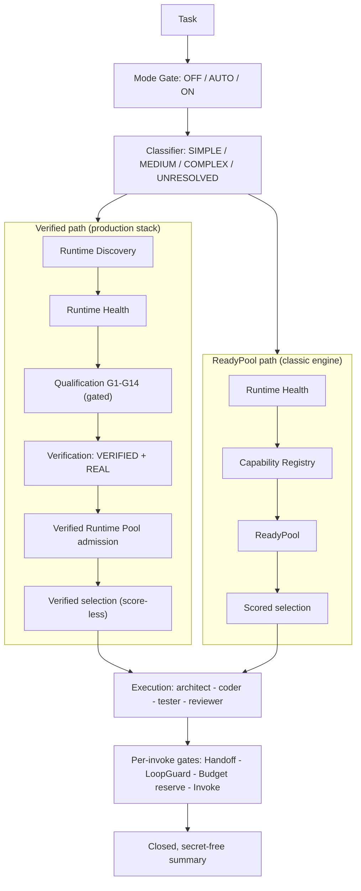

# Runtime-Neutral Agent Engineering

[](https://github.com/Tsubasa-Kaede/runtime-neutral-agent-engineering/actions/workflows/ci.yml)
[](https://github.com/Tsubasa-Kaede/runtime-neutral-agent-engineering/actions/workflows/ci.yml)
[](LICENSE)

> **Discover capabilities. Verify execution. Control collaboration.**

Runtime-Neutral Agent Engineering is the engineering layer between agents and
the runtimes they depend on. It discovers coding-agent CLIs, validates what
they can actually prove, admits them to a verified pool, and orchestrates
their work under explicit budgets and loop protection.

**Agent runtime ≠ agent orchestration.** Runtimes execute; this project
engineers the layer above them. It is **not** a chatbot, a model provider, a
single-runtime wrapper, a remote agent network, an A2A implementation, a
distributed execution platform, or a multi-agent network.

What the layer provides:

- **Runtime Discovery** — is a runtime present at all?
- **Runtime Validation** — gated qualification runs (G1–G14) producing real evidence
- **Capability-based Selection** — selection by proven capability, never by name
- **Agent Orchestration** — architect → coder → tester → reviewer stage chains
- **Structured Collaboration** — validated packets over an append-only ledger
- **Budget Control** — invocation slots reserved before every call
- **LoopGuard** — duplicate / repeated-failure / cycle protection before spend
- **Provenance** — every validation result carries OFFLINE or REAL evidence
- **Security Boundary** — no-secrets contract, content scanning, protected paths

**Contents:** [Why](#why) · [Quick Start](#quick-start) · [Core Concepts](#core-concepts) · [Architecture](#architecture) · [Agent Runtime Support](#agent-runtime-support) · [Installation](#installation) · [Configuration](#configuration) · [Modes](#modes) · [Agent Collaboration](#agent-collaboration) · [Extending Runtime](#extending-runtime) · [Security](#security) · [Testing](#testing) · [Verification Status](#verification-status) · [Release](#release) · [Limitations](#limitations) · [Contributing](#contributing) · [License](#license)

## Why

| Problem | How this project addresses it |
|---|---|
| Orchestration logic coupled to one specific runtime | Runtime-neutral engine core; runtimes plug in through an adapter contract. No runtime, provider, or model name is hard-coded in the engine |
| Runtime state is opaque — installed? logged in? working? | Discovery and Health are explicit, structured checks with closed state vocabularies |
| Capability and health get conflated | Health (READY) and capability (proven evidence) are separate layers; neither implies the other |
| Multi-agent collaboration lacks structured contracts | Stages exchange typed packets through a protocol contract and an append-only ledger — never raw model output |
| Real verification is unclear or claimed without evidence | Provenance is enforced: the runner refuses to grant REAL without real-call evidence; Offline validation is not REAL validation |
| Agent calls have no unified budget | TaskBudget spans one task lifecycle with reserve-before-invoke semantics |
| Multi-stage work lacks loop protection | LoopGuard pre-checks duplicates, repeated failures, and cycles before any spend |
| Runtime-specific logic pollutes the orchestration layer | Adapters own all runtime specifics; the orchestrator only sees the adapter protocol |

## Quick Start

Try it in 30 seconds — from a fresh clone, offline, no runtime, login, or
configuration needed:

```bash
git clone https://github.com/Tsubasa-Kaede/runtime-neutral-agent-engineering.git
cd runtime-neutral-agent-engineering
python examples/offline_mock_run.py
```

Expected output — a closed, secret-free JSON summary:

```json
{"path": "FOUR_STAGE", "status": "SUCCESS", "stages": ["architect","coder","tester","reviewer"], ...}
```

To run real tasks through the CLI, see [Installation](#installation)
(environment setup) and [Modes](#modes) (CLI usage and facade injection).

## Core Concepts

| Concept | Meaning |
|---|---|
| Runtime Discovery | Does the runtime exist? (`DISCOVERED` / `NOT_FOUND`) |
| Runtime Health | Is it usable right now? (`READY` / `AUTH_REQUIRED` / `UNAVAILABLE` / `ERROR`) |
| Agent Capability | What a runtime has *proven* it can do (architecture, coding, testing, review) — built only from gate evidence, never from declarations |
| Candidate Validation | The gated qualification run (G1–G14) over a runtime candidate |
| Verified Runtime | A runtime whose validation concluded `VERIFIED` with `REAL` provenance |
| Runtime Selection | Choosing agents by verified capability subset; the verified path is score-less and never falls back to the ready pool |
| Mode Gate | Caller intent: OFF / AUTO / ON routing |
| Collaboration Packet | The protocol contract between stages — who owes what work, on a frozen envelope schema |
| Collaboration Transport | The delivery mechanism — an in-process mailbox today |
| Provenance | Evidence class of a validation result: `OFFLINE` (mock) or `REAL` (real calls under an explicit gate) |
| Task Budget | Per-task invocation accounting; a call either happened-and-was-paid or never happened |
| LoopGuard | Pre-invoke protection against duplicate tasks, repeated failures, and cycles |

## Architecture

Two execution paths share one engine; the entry point decides which runs:



- The **ReadyPool path** (classic engine) admits runtimes on health and scores
  candidates from registry evidence.
- The **Verified path** (production stack) requires a gated qualification run,
  `VERIFIED` + `REAL` evidence, and Verified Runtime Pool admission before
  execution — and it **never falls back**.
- Load-bearing invariant: **the verified path never silently borrows the
  ReadyPool.** An empty verified selection normalizes to `NO_CAPABLE_AGENT`
  instead of consulting the ready-pool registry, and the verified orchestrator
  executes with an empty fallback policy.
- The five distinctions the engine never blurs: Discovery ≠ Health,
  Health ≠ Qualification, Qualification ≠ Verification, Verification ≠
  Admission, READY ≠ VERIFIED.

Task lifecycle: one `ProductionFacade` owns exactly one task. Budget, guard,
and ledger are per-task and never reset between runs. SINGLE path: at most 1
real invocation. Four-stage path: at most 4 (each role exactly once); beyond
that, `BUDGET_EXHAUSTED`. A new task needs a new facade.

## Agent Runtime Support

Support tiers, strictly separated:

| Runtime | Adapter | Discovery | Authentication | REAL verification | Status |
|---|---|---|---|---|---|
| Claude Code CLI | Implemented (`claude_code_adapter.py`) | `claude` executable on PATH | Its own login flow (first-party observed) | ✅ Full chain proven — Discovery → Health → REAL qualification → `VERIFIED` + `REAL`, all four capabilities, pool admission (v2.1.227, gated test `tests/test_rc3_real_discovery.py`) | **Implemented + Real Verified** |
| tiny-agents | Implemented (`tiny_agents_adapter.py`) | Executable **plus** `TINY_AGENTS_AGENT_PATH` **plus** `TINY_AGENTS_COMMAND` — all three required, else honestly absent | n/a | ❌ Not performed | **Implemented (adapter-level)**; on the reference machine it is unconfigured → not registered |
| Codex CLI | None shipped | n/a | n/a | ❌ | **Architecture-compatible** (mentioned in the adapter contract; no adapter in this repository) |
| Any other CLI | None — implement the adapter contract | n/a | n/a | ❌ | **Architecture-compatible** |

"Architecture-compatible" means the design allows integration; it does not
mean supported.

## Installation

Python 3.10+ (3.10 / 3.11 / 3.12 tested in CI). The engine is pure standard
library with zero runtime dependencies.

This project is **not published on PyPI** — install from source:

```bash
git clone https://github.com/Tsubasa-Kaede/runtime-neutral-agent-engineering.git
cd runtime-neutral-agent-engineering
python -m venv .venv
.venv\Scripts\activate          # Windows
# source .venv/bin/activate     # macOS / Linux
pip install -e .
```

This installs the `dual_agent` package (mapped from
`dual-agent-development/scripts/`), the `dual-agent` console script, and the
skill assets (`SKILL.md`, references, templates, agents, examples).

Verify the install:

```bash
dual-agent --version
```

## Configuration

There is no configuration file. The engine reads exactly these environment
variables:

| Variable | Purpose | Default |
|---|---|---|
| `RUN_REAL_PROVIDER_TESTS` | Set to `1` to opt in to REAL runtime tests (they invoke real runtimes) | unset — REAL tests stay skipped |
| `TINY_AGENTS_AGENT_PATH` | tiny-agents agent path; required (with the executable and `TINY_AGENTS_COMMAND`) for registration | unset — tiny-agents stays unregistered |
| `TINY_AGENTS_COMMAND` | tiny-agents command; see above | unset |

Runtime prerequisites (runtime-level, not dependencies of this package):

| Runtime | Prerequisite |
|---|---|
| Claude Code CLI | `claude` on PATH, logged in through its own flow (the CLI itself requires Node.js) |
| tiny-agents | Executable + both environment variables above |

Additional behavior is set through constructor parameters, not environment:
mode is a CLI flag (`--mode`), and health-check timeouts are parameters
(discovery checks use 10 s; the minimal health check is capped at 30 s).

**Secrets:** never put API keys or tokens in the repository, in examples, or
in committed environment files. The engine never reads, stores, prints, or
modifies credentials; runtime authentication belongs to the runtime, not to
this layer.

## Modes

The CLI parses arguments and invokes a **host-injected** facade:

```bash
dual-agent run --mode off  "Implement a GitHub webhook"
dual-agent run --mode auto "Implement a GitHub webhook"
dual-agent run --mode on   "Implement a GitHub webhook"
```

Honest limitation: the CLI never creates runtimes, adapters, credentials, or
a default facade — without an injected facade it exits with a clear error. A
host injects like this:

```python
from dual_agent import cli
cli.main._facade = my_configured_facade   # build with your adapters/pool
```

See `examples/offline_mock_run.py` for constructing the facade from real
engine components, and `host.py` (`build_facade`) for the host-facing
construction API.

| Mode | Behavior |
|---|---|
| `OFF` | No orchestration; returns the delegated empty result — never silently runs |
| `AUTO` (default) | Classify the task; SIMPLE / MEDIUM / UNRESOLVED take the single-agent path, COMPLEX takes the dual-agent path |
| `ON` | Force the dual-agent path (architect + coder; tester + reviewer when qualified candidates exist) |

Task classification is a closed keyword table (SIMPLE / MEDIUM / COMPLEX /
UNRESOLVED) — a deterministic classifier, not a model. Tasks with no keyword
hit classify as UNRESOLVED and take the orchestration path.

Without verified tester / reviewer candidates, dual-agent success is reported
as `NO_VERIFICATION_CAPABILITY` — never a silent two-stage success, never a
fabricated four-stage success.

Failures are structured and terminal; downstream stages do not run after an
upstream failure:

- `*_INVOKE_FAILED`, `*_PACKET_INVALID` — a stage failed on the runtime or the packet contract
- `MISSING_HANDOFF` — a required upstream packet is absent from the ledger
- `BUDGET_EXHAUSTED`, `LOOP_GUARD_REJECTED` — task-lifecycle guards
- `NO_CAPABLE_AGENT`, `NO_VERIFICATION_CAPABILITY` — no verified candidates

Honest retries require a new `task_id`; the loop guard rejects re-running the
same stage of the same task.

## Agent Collaboration

Four stages, four contracts:

```text
Architect
    ↓  ArchitecturePacket
Coder
    ↓  ImplementationPacket
Tester
    ↓  TestPacket
Reviewer
    ↓  ReviewPacket
```

| Role | Reads | Produces |
|---|---|---|
| architect | the task itself | `ArchitecturePacket` |
| coder | architecture packet wire text | `ImplementationPacket` |
| tester | latest implementation packet | `TestPacket` |
| reviewer | architecture + implementation + test | `ReviewPacket` |

Two layers that are easy to conflate but are not the same:

- **`CollaborationPacket` is the protocol contract** — who owes what work, on
  a frozen envelope schema.
- **Transport is the delivery mechanism** — an in-process mailbox today.

The remote transport module defines a boundary contract with a loopback
implementation only. This release contains **no** remote agent network, no
A2A protocol, no distributed execution, and no multi-agent network.

## Extending Runtime

New runtimes integrate through the `ExternalAgentAdapter` protocol
(`dual-agent-development/scripts/external_agent_adapter.py`) with three
methods:

- `discover()` → `RuntimeDiscovery` — is the runtime present?
- `invoke(request)` → `InvocationResult` — run one agent request
- `cancel(invocation_id)` → `InvocationResult` — cancel an in-flight invocation

Adapters own all runtime specifics — executable resolution, authentication
state, subprocess environment (whitelisted: `PATH` / `HOME` / `USERPROFILE` /
`SYSTEMROOT`), error normalization. The orchestrator only sees the protocol,
so adding a runtime never means modifying the orchestrator.

Registration goes through the runtime adapter registry
(`runtime_adapter_registry.py`, `register(AdapterDescriptor)`) and the
discovery bootstrap (`discovery_bootstrap.py`). The full contract is
documented in
[`dual-agent-development/references/adapter-contract.md`](dual-agent-development/references/adapter-contract.md),
and `adapter_probe.py` is a small developer probe for exercising an adapter
by hand.

Note: there is no third-party plugin package API in this release — extending
means implementing the protocol inside a checkout, as the built-in adapters
do.

## Security

- **No-secrets contract**: raw output, secrets, and model reasoning never
  enter packets, the ledger, traces, or public results; `content_safety` is
  the single scan authority.
- **Raw-output quarantine**: stage inputs are always upstream packets; raw
  output must pass the packet contract and content scan before reaching the
  next stage.
- **Protected paths**: REAL validation snapshots caller-declared protected
  files (credentials / config); any change during the run fails gate G13.
- **Minimal environment**: adapters start subprocesses with a whitelist env
  (`PATH` / `HOME` / `USERPROFILE` / `SYSTEMROOT`) — credential-bearing
  variables are never forwarded.
- **Safe error normalization**: adapter error text is shape-scrubbed before
  reaching traces or reports.
- The engine never reads, stores, prints, or modifies credentials; never logs
  in or out; never touches runtime configuration. Authentication belongs to
  the runtime.
- Real runtime calls are opt-in and off by default (`RUN_REAL_PROVIDER_TESTS=1`
  gates the real tests).
- CLI output is a closed allow-list summary.

## Testing

### Offline Tests

```bash
python -m pytest tests/ -q                     # offline suite + gated skips
python -m unittest discover -s tests           # equivalent stdlib runner
python -m compileall -q dual-agent-development # syntax gate
```

Offline baseline measured at commit `04133ec`:
**945 passed / 14 skipped / 377 subtests.** Every skip is an opt-in
REAL-gated test entry.

### REAL Runtime Tests

REAL tests invoke real runtimes and require a logged-in `claude` on PATH:

```bash
# Windows (cmd)
set RUN_REAL_PROVIDER_TESTS=1
python -m pytest tests/test_rc3_real_discovery.py -v -s

# macOS / Linux
RUN_REAL_PROVIDER_TESTS=1 python -m pytest tests/test_rc3_real_discovery.py -v -s
```

This qualification run takes several minutes, produces `VERIFIED` + `REAL`
evidence with all four capabilities, and admits the runtime to the Verified
Runtime Pool. One sanctioned qualification is then reused across tasks — the
runtime is never re-qualified per task.

## Verification Status

| Area | Status |
|---|---|
| Runtime Discovery | Implemented + offline-tested |
| Runtime Health | Implemented + offline-tested |
| Capability Validation (G1–G14) | Implemented + offline-tested |
| Verified Runtime Pool | Implemented + offline-tested |
| Agent Selection (both paths) | Implemented + offline-tested |
| Collaboration contract & packets | Implemented + offline-tested |
| Local transport | Implemented + offline-tested |
| Remote transport | Boundary contract with loopback implementation only — no remote peers |
| Four-stage orchestration | Implemented; proven end-to-end offline |
| Claude Code CLI REAL verification | ✅ Real verified — full chain, v2.1.227, all four capabilities, pool admission |
| tiny-agents REAL verification | Not performed (adapter implemented; offline-tested) |
| Provenance enforcement | Implemented — the runner refuses REAL without real-call evidence |
| Security boundary | Implemented + offline-tested (content safety, protected paths, env whitelist) |

## Release

Current release: **[Runtime-Neutral Agent Engineering v2.0.0](https://github.com/Tsubasa-Kaede/runtime-neutral-agent-engineering/releases/tag/v2.0.0)**
(Latest). An earlier release-candidate tag, `v2.0.0-rc.1`, also exists.

## Limitations

- Only **one runtime** (Claude Code CLI) holds REAL-proven capability
  evidence; the tiny-agents adapter is implemented but not real-verified, and
  no other adapter ships in this repository.
- Runtime availability depends on your environment: PATH executables, login
  state, and (for tiny-agents) two environment variables. Missing pieces mean
  honest absence, never partial registration.
- Task classification is a closed keyword table, not a model.
- The dual-agent path covers architect + coder; tester + reviewer run as
  verification stages gated on dual-agent success.
- Qualification is a point-in-time proof; stability over repeated runs is a
  separate measurement, not a guarantee.
- Package maturity: source install only (no PyPI package); the CLI requires a
  host-injected facade by design.
- No remote collaboration in this release — the remote transport is a
  loopback boundary contract.

## Contributing

Simple GitHub workflow:

1. Fork the repository
2. Create a branch for your change
3. Make the change
4. Run the offline suite (`python -m pytest tests/ -q`) and keep it green
5. Open a Pull Request

## License

MIT — see [LICENSE](LICENSE).
