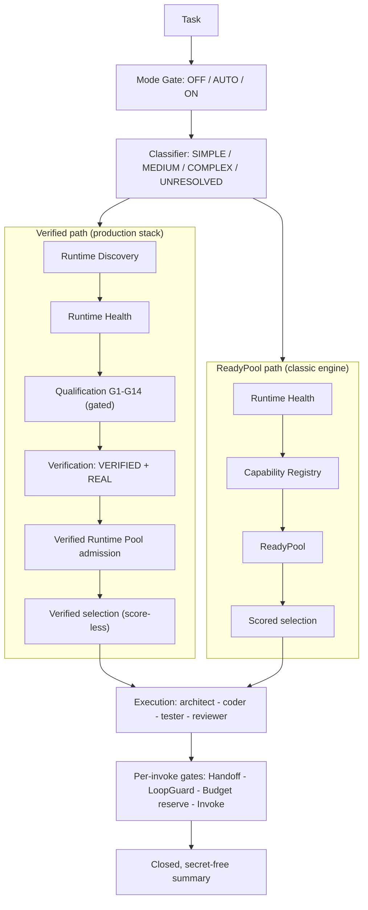

# Runtime-Neutral Agent Engineering

[](https://github.com/Tsubasa-Kaede/runtime-neutral-agent-engineering/actions/workflows/ci.yml)
[](https://github.com/Tsubasa-Kaede/runtime-neutral-agent-engineering/actions/workflows/ci.yml)
[](LICENSE)

> **Discover capabilities. Verify execution. Control collaboration.**

Runtime-Neutral Agent Engineering is the engineering layer between agents and
the runtimes they depend on. It discovers coding-agent CLIs, validates what
they can actually prove, admits them to a verified pool, and orchestrates
their work under explicit budgets and loop protection.

**Agent runtime ≠ agent orchestration.** Runtimes execute; this project
engineers the layer above them. It is **not** a chatbot, a model provider, a
single-runtime wrapper, a remote agent network, an A2A implementation, a
distributed execution platform, or a multi-agent network.

**Agent runtime support today:** ✅ Claude Code CLI — implemented + REAL-verified · ⚠️ tiny-agents — adapter implemented, offline-tested (not REAL-verified) · ⚠️ Codex CLI — adapter implemented, offline-tested (not REAL-verified). Details in [Agent Runtime Support](#agent-runtime-support).

**Contents:** [Overview](#overview) · [Why](#why) · [Quick Start](#quick-start) · [Integration](#integration) · [Agent Runtime Support](#agent-runtime-support) · [Agent Runtime Ecosystem](#agent-runtime-ecosystem) · [Installation](#installation) · [Configuration](#configuration) · [Core Concepts](#core-concepts) · [Architecture](#architecture) · [Modes](#modes) · [Agent Collaboration](#agent-collaboration) · [Extending Runtime](#extending-runtime) · [Security](#security) · [Testing](#testing) · [Verification Status](#verification-status) · [Release](#release) · [Limitations](#limitations) · [Contributing](#contributing) · [License](#license)

## Overview

**What** — a runtime-neutral agent engineering and orchestration layer that
sits between your application and the coding-agent CLIs it drives.

**Why** — orchestration logic keeps getting hard-coupled to one runtime.
This layer decouples the two: your application talks to the engine, and the
engine discovers, verifies, and orchestrates whatever runtime you plug in
through the adapter contract. Your code never binds to Claude Code or any
other runtime by name.

**What it does** — the layer provides:

- **Runtime Discovery** — is a runtime present at all?
- **Runtime Validation** — gated qualification runs (G1–G14) producing real evidence
- **Capability-based Selection** — selection by proven capability, never by name
- **Agent Orchestration** — architect → coder → tester → reviewer stage chains
- **Structured Collaboration** — validated packets over an append-only ledger
- **Budget Control** — invocation slots reserved before every call
- **LoopGuard** — duplicate / repeated-failure / cycle protection before spend
- **Provenance** — every validation result carries OFFLINE or REAL evidence
- **Security Boundary** — no-secrets contract, content scanning, protected paths

**What it supports** — support is reported at two strictly separated
levels: **REAL verified** · **adapter implemented**. The
[Agent Runtime Support](#agent-runtime-support) section defines each level,
and [Agent Runtime Ecosystem](#agent-runtime-ecosystem) lists the runtimes
with actual integration evidence in this repository.

**Current Runtime Integration**

- 1 REAL-verified — Claude Code CLI
- 2 adapter-level — tiny-agents, Codex CLI
- + more via the `ExternalAgentAdapter` contract

These counts describe this repository's integrations, not the size of the
agent ecosystem.

## Why

| Problem | How this project addresses it |
|---|---|
| Orchestration logic coupled to one specific runtime | Runtime-neutral engine core; runtimes plug in through an adapter contract. No runtime, provider, or model name is hard-coded in the engine |
| Runtime state is opaque — installed? logged in? working? | Discovery and Health are explicit, structured checks with closed state vocabularies |
| Capability and health get conflated | Health (READY) and capability (proven evidence) are separate layers; neither implies the other |
| Multi-agent collaboration lacks structured contracts | Stages exchange typed packets through a protocol contract and an append-only ledger — never raw model output |
| Real verification is unclear or claimed without evidence | Provenance is enforced: the runner refuses to grant REAL without real-call evidence; Offline validation is not REAL validation |
| Agent calls have no unified budget | TaskBudget spans one task lifecycle with reserve-before-invoke semantics |
| Multi-stage work lacks loop protection | LoopGuard pre-checks duplicates, repeated failures, and cycles before any spend |
| Runtime-specific logic pollutes the orchestration layer | Adapters own all runtime specifics; the orchestrator only sees the adapter protocol |

## Quick Start

Install the published package from PyPI — Python >= 3.10, zero runtime
dependencies, no clone needed:

```bash
pip install dual-agent-development==2.1.0
dual-agent --version
```

> Name map: the GitHub repository is `runtime-neutral-agent-engineering`;
> the PyPI distribution is `dual-agent-development` (import `dual_agent`,
> console script `dual-agent`).

Or try it in 30 seconds from a fresh clone — offline, no runtime, login, or
configuration needed:

```bash
git clone https://github.com/Tsubasa-Kaede/runtime-neutral-agent-engineering.git
cd runtime-neutral-agent-engineering
python examples/offline_mock_run.py
```

Expected output — a closed, secret-free JSON summary:

```json
{"path": "FOUR_STAGE", "status": "SUCCESS", "stages": ["architect","coder","tester","reviewer"], ...}
```

To run real tasks through the CLI, see [Installation](#installation)
(environment setup) and [Modes](#modes) (CLI usage and facade injection).
To connect a real runtime or your own application, see
[Integration](#integration).

## Integration

Three on-ramps, from a 30-second offline taste to a real application.

### How it fits

```text
User Application
      ↓
Host / Facade  (ProductionFacade via host.py)
      ↓
Runtime Discovery  →  Runtime Health  →  G1–G14 Qualification (gated)
      ↓
Verified Runtime Pool  (VERIFIED + REAL evidence only)
      ↓
Orchestration  (Budget reserve + LoopGuard before every invoke)
      ↓                                  ↓
Claude Code CLI                  Your runtime adapter
(verified integration)           (implement ExternalAgentAdapter)
```

The agent runtime is an **external dependency**, never a component of this
project: the engine discovers, verifies, and orchestrates; the runtime
executes.

### Try Offline

```bash
git clone https://github.com/Tsubasa-Kaede/runtime-neutral-agent-engineering.git
cd runtime-neutral-agent-engineering
python examples/offline_mock_run.py
```

- No runtime, no login, no credentials, no network
- Runs the real ProductionFacade end to end with mock adapters
- Prints one closed, secret-free JSON summary

### Run with Claude Code

`RUN_REAL_PROVIDER_TESTS=1` is a safety gate, not a test-only switch: real
runtime health checks and real invocations — in the gated tests and in
`minimal_host_app.py` alike — run only when it is explicitly set in the
environment. It exists so a real call can never happen by accident; do not
bypass or hard-code it.

```bash
# Windows (cmd)
set RUN_REAL_PROVIDER_TESTS=1
python examples/minimal_host_app.py "Add a slug helper and its test"

# Windows (PowerShell)
$env:RUN_REAL_PROVIDER_TESTS="1"
python examples/minimal_host_app.py "Add a slug helper and its test"

# macOS / Linux
RUN_REAL_PROVIDER_TESTS=1 python examples/minimal_host_app.py "Add a slug helper and its test"
```

The first run performs the gated G1–G14 qualification (several minutes)
and admits the runtime to the Verified Runtime Pool; that qualification
evidence is then reused across tasks instead of re-running per task. The
example fails honestly — non-zero exit, one-line reason — when the CLI is
absent, not logged in, or fails qualification. It never falls back to
mock or offline execution.

### Responsibility Boundary

| Responsibility | Scope | Execution Boundary |
|---|---|---|
| Claude Code installation and authentication | Claude Code CLI installation, authentication, and PATH availability | External to this project |
| REAL runtime opt-in | Setting `RUN_REAL_PROVIDER_TESTS=1` when REAL tests are intentionally executed | Explicitly controlled outside the project |
| Protected-path declaration | Paths required by the G13 protection gate | Declared by the execution environment |
| Runtime qualification and orchestration | Discovery, health checks, G1–G14 qualification, Verified Pool admission, orchestration, budget enforcement, and LoopGuard | Handled by the project |
| Credentials and runtime configuration | API keys, login/logout, and runtime configuration | Not accessed or managed by the project |

The project does not install, authenticate, or manage Claude Code or its
credentials. It invokes an already installed and configured runtime through
the `ExternalAgentAdapter` contract.

### REAL Runtime Usage

The currently REAL-verified runtime is Claude Code CLI. The user installs and
authenticates Claude Code through its own tooling; this project invokes the
already configured runtime through the `ExternalAgentAdapter` contract. This
project never installs or logs in to Claude Code, never manages its
credentials, and never modifies its runtime configuration.

The REAL dual-agent collaboration fact base (one REAL-verified runtime —
not two runtimes):

- two role-qualified agent invocations (architect and coder)
- Architect → `CollaborationPacket` → transport → Coder → reply
- `provenance=REAL` on both envelopes
- one shared `correlation_id` across both legs
- delivery receipts `DELIVERED` in both directions
- no fallback and no mock standing in for REAL

### Integrate into Your Application

The same chain as a library (runnable file:
[`examples/minimal_host_app.py`](examples/minimal_host_app.py)):

```python
import sys
from pathlib import Path

ROOT = Path(__file__).resolve().parents[1]
sys.path.insert(0, str(ROOT / "dual-agent-development" / "scripts"))

from claude_code_adapter import ClaudeCodeAdapter
from generic_runtime_health import GenericRuntimeHealth
from host import build_facade_from_bootstrap
from mode_gate import Mode
from real_validation_executor import run_real_validation
from runtime_adapter_registry import (
    AdapterDescriptor, AdapterRegistry, discovery_sources)
from runtime_discovery import RuntimeCandidateDiscovery

adapter = ClaudeCodeAdapter.from_environment()   # None when not installed
if adapter is None:
    raise SystemExit("Claude Code CLI not found on PATH")

registry = AdapterRegistry()
registry.register(AdapterDescriptor(
    runtime_id="claude-cli", provider_id="anthropic", model_id=None,
    runtime_type="coding-agent", display_name="Claude Code",
    adapter_factory=lambda: adapter, config_fingerprint="installed"))

def qualify(instance):
    validation, _ = run_real_validation(
        instance, instance.probe, timeout_seconds=300.0,
        protected_paths=(Path.home() / ".claude" / ".credentials.json",))
    return validation

health = {}
for candidate in RuntimeCandidateDiscovery(
        discovery_sources(registry)).discover_all():
    if candidate.available:
        item = registry.get(candidate.runtime_id)
        checked = GenericRuntimeHealth().check(candidate, item.adapter_factory())
        health[candidate.runtime_id] = checked.status

facade = build_facade_from_bootstrap(
    registry, qualifier=qualify, current_health=health)
result = facade.run(task_id="my-task", task=task, prompt=task, mode=Mode.ON)
```

`facade.run` omits `provenance` on purpose: the HostFacade labels every run
from the qualification evidence, so a real run can never be mislabeled
OFFLINE at the CLI seam. To drive the same facade from the `dual-agent`
CLI, inject it — `cli.main._facade = facade` — see [Modes](#modes).

For any other runtime, implement the six-method adapter contract — see
[Extending Runtime](#extending-runtime).

## Agent Runtime Support

This project does **not** bundle, replace, or depend on a specific agent
runtime. It integrates with external coding-agent CLIs through adapters,
and support is reported at two strictly separated levels:

- **REAL VERIFIED** — an adapter ships in this repository, discovery works,
  offline tests cover it, and a gated REAL qualification run produced
  `VERIFIED` + `REAL` evidence with Verified Runtime Pool admission.
- **Adapter implemented** — an adapter ships and is covered by offline
  tests, but no REAL qualification run has ever been performed for it.
  Adapter implemented, but not REAL-verified.

### Runtime Compatibility Matrix

| Agent Runtime / Tool | Adapter | Discovery | Offline Tests | REAL Verification |
|---|---|---|---|---|
| Claude Code CLI | `claude_code_adapter.py` | `claude` executable available on PATH | ✅ `tests/test_claude_health.py` | ✅ REAL VERIFIED — Discovery → Health → G1–G14 qualification → Verified Pool admission → REAL dual-agent collaboration (v2.1.227) |
| tiny-agents | `tiny_agents_adapter.py` | Runtime entry provided by `TINY_AGENTS_AGENT_PATH` / `TINY_AGENTS_COMMAND` | ✅ `tests/test_tiny_agents_adapter.py` | ❌ Not performed |
| Codex CLI | `codex_adapter.py` | `codex` executable available on PATH | ✅ `tests/test_codex_adapter.py` | ❌ Not performed |

### What "Supported" Means

Support is reported at exactly two levels:

- **REAL VERIFIED** — an adapter is implemented and has passed real runtime
  qualification / REAL verification.
- **Adapter implemented** — an adapter is implemented and covered by
  offline tests, but REAL runtime verification has not been performed.

Treat an adapter-implemented runtime as unverified until you run a REAL
qualification in your own environment.

### Which runtime should I use?

| If you use… | Do this |
|---|---|
| Claude Code CLI | Supported today (REAL VERIFIED) — [Integration](#integration) → "Run with Claude Code" |
| tiny-agents | Adapter is ready: install the executable, set both `TINY_AGENTS_*` variables, then REAL-verify it in your environment before production use |
| Codex CLI | Adapter is ready: install the CLI yourself, log in through its own flow, then REAL-verify it in your environment before production use |
| Your own CLI or runtime | Implement the six-method `ExternalAgentAdapter` contract; the orchestrator never needs modification |

### Current Support Boundary

Exactly one runtime — Claude Code CLI — holds REAL-proven capability
evidence in this repository. Nothing else is supported in the verified
sense, and the boundary is enforced by the engine itself: no admission
without `VERIFIED` + `REAL` evidence, and no fallback to weaker paths.

## Agent Runtime Ecosystem

This section lists the runtimes that currently have actual integration
evidence in this repository — a shipped adapter and, where stated, REAL
verification. It makes no claim about tools not listed here.

| Tool / Runtime | Category | Integration Status |
|---|---|---|
| Claude Code CLI | Coding Agent CLI | **REAL VERIFIED** |
| tiny-agents (Hugging Face) | Minimal Agent Runtime | **Adapter implemented** |
| Codex CLI | Coding Agent CLI | **Adapter implemented** |

The "Integration Status" column uses two fixed values: **REAL VERIFIED**
and **Adapter implemented**. tiny-agents and Codex CLI are
adapter-implemented, but not REAL-verified.

## Installation

Python 3.10+ (3.10 / 3.11 / 3.12 tested in CI). The engine is pure standard
library with zero runtime dependencies. Published on PyPI as
**`dual-agent-development`** — install from the registry or from source:

### Option 1 — Install from PyPI (recommended)

The published distribution — no clone, no build step:

```bash
pip install dual-agent-development==2.1.0
```

- Distribution [`dual-agent-development` on PyPI](https://pypi.org/project/dual-agent-development/) — note the GitHub repository name (`runtime-neutral-agent-engineering`) and the PyPI package name are different
- Installs the `dual_agent` package, the `dual-agent` console script, and the skill assets (`SKILL.md`, references, templates, agents, examples)
- Python >= 3.10, zero runtime dependencies; `dual-agent --version` verifies the install

### Option 2 — Clone and Run

The fastest first taste: nothing is installed, and the example runs
straight from the checkout.

```bash
git clone https://github.com/Tsubasa-Kaede/runtime-neutral-agent-engineering.git
cd runtime-neutral-agent-engineering
python examples/offline_mock_run.py
```

- Python 3.10+ is the only prerequisite
- No agent runtime required, no login, no credentials, no network
- No package installation for the offline example

### Option 3 — Editable Installation

The regular development setup:

```bash
git clone https://github.com/Tsubasa-Kaede/runtime-neutral-agent-engineering.git
cd runtime-neutral-agent-engineering
python -m venv .venv

.venv\Scripts\activate          # Windows
# source .venv/bin/activate     # macOS / Linux

python -m pip install -e .
dual-agent --version
```

This installs the `dual_agent` package (mapped from
`dual-agent-development/scripts/`), the `dual-agent` console script, and
the skill assets (`SKILL.md`, references, templates, agents, examples).
For development on the engine itself, `pip install -e .` from a checkout
is the editable equivalent of the PyPI install.

### Option 4 — One-command Bootstrap

```bash
python scripts/bootstrap.py
```

The bootstrap creates (or reuses) `.venv`, installs this project into it,
and prints the next steps. It installs **this project only**: it never
installs or logs into a third-party agent runtime, never reads secrets or
`.env` files, and never modifies system-level configuration, `PATH`, or
shell profiles. `--check` runs a no-side-effect preflight (Python version
and repository layout — no files created, no network used):

```bash
python scripts/bootstrap.py --check
```

### Install with an AI Coding Agent

You can hand the setup to a user-side coding agent (Claude Code, Codex
CLI, Gemini CLI, Cursor, Cline, ...) with a prompt like:

> Clone this repository, inspect its README installation instructions,
> create the recommended Python environment, and install this project
> only. Then run `dual-agent --version` and the offline smoke example,
> and report the result. Do not install any third-party Agent Runtime.
> Do not read or configure API keys, secrets, or credentials, and do not
> log in to or out of any service. Do not modify system-level
> configuration.

This is user-side assistance — not a dependency of this project, and not
a statement that these agents are integrated or verified by it.

## Configuration

### Runtime Configuration

No project-specific runtime configuration file is required. The engine
reads environment variables when the corresponding runtime integration
uses them.

| Variable | Purpose |
|---|---|
| `RUN_REAL_PROVIDER_TESTS` | Enables gated REAL runtime tests when set to `1` |
| `TINY_AGENTS_AGENT_PATH` | Path to the tiny-agents agent executable or configuration |
| `TINY_AGENTS_COMMAND` | Command used to invoke the configured tiny-agents agent |

These variables are optional. They are not required for the core engine or
for the currently verified Claude Code path.

Runtime prerequisites (runtime-level, not dependencies of this package):

| Runtime | Prerequisite |
|---|---|
| Claude Code CLI | `claude` on PATH, logged in through its own flow (the CLI itself requires Node.js) |
| Codex CLI | `codex` on PATH, logged in through its own flow |
| tiny-agents | Executable + both environment variables above |

Additional behavior is set through constructor parameters, not environment:
mode is a CLI flag (`--mode`), and health-check timeouts are parameters
(discovery checks use 10 s; the minimal health check is capped at 30 s).

**Secrets:** never put API keys or tokens in the repository, in examples, or
in committed environment files. The engine never reads, stores, prints, or
modifies credentials; runtime authentication belongs to the runtime, not to
this layer.

## Core Concepts

| Concept | Meaning |
|---|---|
| Runtime Discovery | Does the runtime exist? (`DISCOVERED` / `NOT_FOUND`) |
| Runtime Health | Is it usable right now? (`READY` / `AUTH_REQUIRED` / `UNAVAILABLE` / `ERROR`) |
| Agent Capability | What a runtime has *proven* it can do (architecture, coding, testing, review) — built only from gate evidence, never from declarations |
| Candidate Validation | The gated qualification run (G1–G14) over a runtime candidate |
| Verified Runtime | A runtime whose validation concluded `VERIFIED` with `REAL` provenance |
| Runtime Selection | Choosing agents by verified capability subset; the verified path is score-less and never falls back to the ready pool |
| Mode Gate | Caller intent: OFF / AUTO / ON routing |
| Collaboration Packet | The protocol contract between stages — who owes what work, on a frozen envelope schema |
| Collaboration Transport | The delivery mechanism — an in-process mailbox today |
| Provenance | Evidence class of a validation result: `OFFLINE` (mock) or `REAL` (real calls under an explicit gate) |
| Task Budget | Per-task invocation accounting; a call either happened-and-was-paid or never happened |
| LoopGuard | Pre-invoke protection against duplicate tasks, repeated failures, and cycles |

## Architecture

Two execution paths share one engine; the entry point decides which runs:



- The **ReadyPool path** (classic engine) admits runtimes on health and scores
  candidates from registry evidence.
- The **Verified path** (production stack) requires a gated qualification run,
  `VERIFIED` + `REAL` evidence, and Verified Runtime Pool admission before
  execution — and it **never falls back**.
- Load-bearing invariant: **the verified path never silently borrows the
  ReadyPool.** An empty verified selection normalizes to `NO_CAPABLE_AGENT`
  instead of consulting the ready-pool registry, and the verified orchestrator
  executes with an empty fallback policy.
- The five distinctions the engine never blurs: Discovery ≠ Health,
  Health ≠ Qualification, Qualification ≠ Verification, Verification ≠
  Admission, READY ≠ VERIFIED.

Task lifecycle: one `ProductionFacade` owns exactly one task. Budget, guard,
and ledger are per-task and never reset between runs. SINGLE path: at most 1
real invocation. Four-stage path: at most 4 (each role exactly once); beyond
that, `BUDGET_EXHAUSTED`. A new task needs a new facade.

## Modes

The CLI parses arguments and invokes a **host-injected** facade:

```bash
dual-agent run --mode off  "Implement a GitHub webhook"
dual-agent run --mode auto "Implement a GitHub webhook"
dual-agent run --mode on   "Implement a GitHub webhook"
```

Honest limitation: the CLI never creates runtimes, adapters, credentials, or
a default facade — without an injected facade it exits with a clear error. A
host injects like this:

```python
from dual_agent import cli
cli.main._facade = my_configured_facade   # build with your adapters/pool
```

See `examples/offline_mock_run.py` for constructing the facade from real
engine components, `examples/minimal_host_app.py` for the full REAL-path
chain (discovery → qualification → facade), and `host.py`
(`build_facade`) for the host-facing construction API.

| Mode | Behavior |
|---|---|
| `OFF` | No orchestration; returns the delegated empty result — never silently runs |
| `AUTO` (default) | Classify the task; SIMPLE / MEDIUM / UNRESOLVED take the single-agent path, COMPLEX takes the dual-agent path |
| `ON` | Force the dual-agent path (architect + coder; tester + reviewer when qualified candidates exist) |

Task classification is a closed keyword table (SIMPLE / MEDIUM / COMPLEX /
UNRESOLVED) — a deterministic classifier, not a model. Tasks with no keyword
hit classify as UNRESOLVED and take the orchestration path.

Without verified tester / reviewer candidates, dual-agent success is reported
as `NO_VERIFICATION_CAPABILITY` — never a silent two-stage success, never a
fabricated four-stage success.

Failures are structured and terminal; downstream stages do not run after an
upstream failure:

- `*_INVOKE_FAILED`, `*_PACKET_INVALID` — a stage failed on the runtime or the packet contract
- `MISSING_HANDOFF` — a required upstream packet is absent from the ledger
- `BUDGET_EXHAUSTED`, `LOOP_GUARD_REJECTED` — task-lifecycle guards
- `NO_CAPABLE_AGENT`, `NO_VERIFICATION_CAPABILITY` — no verified candidates

Honest retries require a new `task_id`; the loop guard rejects re-running the
same stage of the same task.

## Agent Collaboration

Four stages, four contracts:

```text
Architect
    ↓  ArchitecturePacket
Coder
    ↓  ImplementationPacket
Tester
    ↓  TestPacket
Reviewer
    ↓  ReviewPacket
```

| Role | Reads | Produces |
|---|---|---|
| architect | the task itself | `ArchitecturePacket` |
| coder | architecture packet wire text | `ImplementationPacket` |
| tester | latest implementation packet | `TestPacket` |
| reviewer | architecture + implementation + test | `ReviewPacket` |

Two layers that are easy to conflate but are not the same:

- **`CollaborationPacket` is the protocol contract** — who owes what work, on
  a frozen envelope schema.
- **Transport is the delivery mechanism** — an in-process mailbox today.

The remote transport module defines a boundary contract with a loopback
implementation only. This release contains **no** remote agent network, no
A2A protocol, no distributed execution, and no multi-agent network.

## Extending Runtime

Adding a runtime means implementing the adapter contract — the
architecture allows it, and you own the adapter and its verification.

New runtimes integrate through the `ExternalAgentAdapter` protocol
(`dual-agent-development/scripts/external_agent_adapter.py`) with six
methods — three core invocation methods plus three health methods:

Core invocation:

- `discover()` → `RuntimeDiscovery` — is the runtime present?
- `invoke(request)` → `InvocationResult` — run one agent request
- `cancel(invocation_id)` → `InvocationResult` — cancel an in-flight invocation

Health (required to pass the health pipeline and G1-G14 qualification):

- `check_authentication()` → `AuthenticationCheck` — observe the runtime's own read-only auth state
- `check_provider_model()` → `ProviderModelCheck` — gated on observed authentication, never guessed
- `minimal_health_check(timeout_seconds)` → `MinimalHealthCheck` — honest `skipped`/`unsupported` without the REAL gate

A runtime whose CLI has no observable authentication surface cannot be
faked into this shape — see the runtime's adapter notes for its declared
conformance level.

Adapters own all runtime specifics — executable resolution, authentication
state, subprocess environment (whitelisted: `PATH` / `HOME` / `USERPROFILE` /
`SYSTEMROOT`), error normalization. The orchestrator only sees the protocol,
so adding a runtime never means modifying the orchestrator.

Registration goes through the runtime adapter registry
(`runtime_adapter_registry.py`, `register(AdapterDescriptor)`) and the
discovery bootstrap (`discovery_bootstrap.py`). The full contract is
documented in
[`dual-agent-development/references/adapter-contract.md`](dual-agent-development/references/adapter-contract.md),
and `adapter_probe.py` is a small developer probe for exercising an adapter
by hand.

Note: there is no third-party plugin package API in this release — extending
means implementing the protocol inside a checkout, as the built-in adapters
do.

## Security

- **No-secrets contract**: raw output, secrets, and model reasoning never
  enter packets, the ledger, traces, or public results; `content_safety` is
  the single scan authority.
- **Raw-output quarantine**: stage inputs are always upstream packets; raw
  output must pass the packet contract and content scan before reaching the
  next stage.
- **Protected paths**: REAL validation snapshots caller-declared protected
  files (credentials / config); any change during the run fails gate G13.
- **Minimal environment**: adapters start subprocesses with a whitelist env
  (`PATH` / `HOME` / `USERPROFILE` / `SYSTEMROOT`) — credential-bearing
  variables are never forwarded.
- **Safe error normalization**: adapter error text is shape-scrubbed before
  reaching traces or reports.
- The engine never reads, stores, prints, or modifies credentials; never logs
  in or out; never touches runtime configuration. Authentication belongs to
  the runtime.
- Real runtime calls are opt-in and off by default (`RUN_REAL_PROVIDER_TESTS=1`
  gates the real tests).
- CLI output is a closed allow-list summary.

## Testing

### Offline Tests

```bash
python -m pytest tests/ -q                     # offline suite + gated skips
python -m unittest discover -s tests           # equivalent stdlib runner
python -m compileall -q dual-agent-development # syntax gate
```

Offline baseline: **979 passed / 15 skipped / 377 subtests** (945 before the
Integration, bootstrap, Codex adapter, and transport E2E additions). Every
skip is an opt-in REAL-gated test entry.

### REAL Runtime Tests

REAL tests invoke real runtimes and require a logged-in `claude` on PATH:

```bash
# Windows (cmd)
set RUN_REAL_PROVIDER_TESTS=1
python -m pytest tests/test_rc3_real_discovery.py -v -s

# Windows (PowerShell)
$env:RUN_REAL_PROVIDER_TESTS="1"
python -m pytest tests/test_rc3_real_discovery.py -v -s

# macOS / Linux
RUN_REAL_PROVIDER_TESTS=1 python -m pytest tests/test_rc3_real_discovery.py -v -s
```

This qualification run takes several minutes, produces `VERIFIED` + `REAL`
evidence with all four capabilities, and admits the runtime to the Verified
Runtime Pool. One sanctioned qualification is then reused across tasks — the
runtime is never re-qualified per task.

A dual-agent collaboration smoke, gated by `RUN_REAL_PROVIDER_TESTS=1`
(`tests/test_collaboration_session.py`, Claude Code CLI v2.1.227),
additionally proves the architect → packet → transport → coder → reply loop
end to end: two real invocations under two role-qualified agent addresses on
one REAL-verified runtime, `provenance=REAL` on both envelopes, one shared
`correlation_id`, `DELIVERED` receipts in both directions, and
credential-file invariance across the run.

## Verification Status

| Area | Status |
|---|---|
| Runtime Discovery | Implemented + offline-tested |
| Runtime Health | Implemented + offline-tested |
| Capability Validation (G1–G14) | Implemented + offline-tested |
| Verified Runtime Pool | Implemented + offline-tested |
| Agent Selection (both paths) | Implemented + offline-tested |
| Collaboration contract & packets | Implemented + offline-tested |
| Local transport | Implemented + offline-tested |
| Remote transport | Boundary contract with loopback implementation only — no remote peers |
| Four-stage orchestration | Implemented; proven end-to-end offline |
| Dual-agent collaboration (architect → coder) | ✅ Real verified — one REAL-verified runtime, two role-qualified agent invocations, `provenance=REAL` both directions (gated `tests/test_collaboration_session.py`) |
| Claude Code CLI REAL verification | ✅ Real verified — full chain, v2.1.227, all four capabilities, pool admission |
| tiny-agents REAL verification | Not performed (adapter implemented; offline-tested) |
| Codex CLI adapter | Implemented + offline-tested; REAL verification not performed |
| Provenance enforcement | Implemented — the runner refuses REAL without real-call evidence |
| Security boundary | Implemented + offline-tested (content safety, protected paths, env whitelist) |

## Release

Current release: **[Runtime-Neutral Agent Engineering v2.0.0](https://github.com/Tsubasa-Kaede/runtime-neutral-agent-engineering/releases/tag/v2.0.0)**
(Latest). An earlier release-candidate tag, `v2.0.0-rc.1`, also exists.

## Limitations

- Only **one runtime** (Claude Code CLI) holds REAL-proven capability
  evidence; the tiny-agents and Codex adapters are implemented but not
  REAL-verified, and no other adapter ships in this repository.
- Runtime availability depends on your environment: PATH executables, login
  state, and (for tiny-agents) two environment variables. Missing pieces mean
  honest absence, never partial registration.
- Task classification is a closed keyword table, not a model.
- The dual-agent path covers architect + coder; tester + reviewer run as
  verification stages gated on dual-agent success.
- Qualification is a point-in-time proof; stability over repeated runs is a
  separate measurement, not a guarantee.
- Package maturity: source install only (no PyPI package); the CLI requires a
  host-injected facade by design.
- No remote collaboration in this release — the remote transport is a
  loopback boundary contract.

## Contributing

Simple GitHub workflow:

1. Fork the repository
2. Create a branch for your change
3. Make the change
4. Run the offline suite (`python -m pytest tests/ -q`) and keep it green
5. Open a Pull Request

## License

MIT — see [LICENSE](LICENSE).
